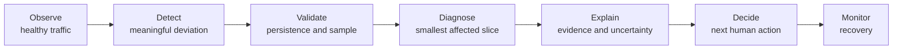
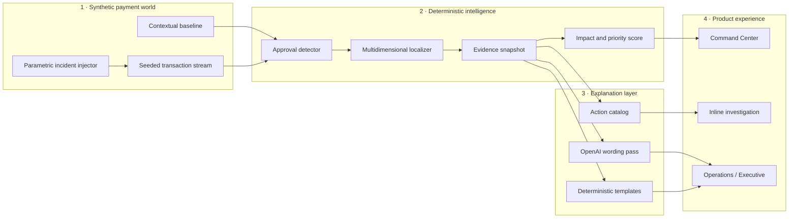

<div align="center">

# Centinel

**Know what is breaking before revenue disappears.**

Payment operations control tower · NextWave Hackathon 2026 · Challenge 2 by Yuno

[](frontend/)
[](backend/)
[](backend/explain/)
[](backend/data/)

**Centinel by toons**

</div>

---

Payment conversion can fall inside one provider, country, payment method, merchant or issuing bank
while revenue disappears by the minute. Existing dashboards expose the symptom; operations teams
still have to cross thousands of transactions to determine what changed, who likely owns it and
what should happen next.

Centinel turns Yuno's cross-provider visibility into **Payment Truth**: an evidence-backed operational
account of what changed, where it changed, why it likely changed, how much it may be costing and
what a human should review next.

```text
Centinel:  Since 14:03 UTC, approval for Adyen · PIX · Brazil has fallen 13.7 pp
           below its contextual baseline. The evidence indicates provider-side
           degradation, with an estimated $16.5k per hour at risk.

Operator:  Why does ownership point to the provider?

Centinel:  The decline-code shift and latency increase are concentrated in Adyen.
           Comparable PIX traffic through peer providers remains within range.
```

> [!IMPORTANT]
> **Statistics calculate. AI explains. A human decides.** Detection, localization, evidence,
> confidence, prioritization and action selection are deterministic. The language model only turns
> a structured evidence bundle into audience-specific wording. It never remediates production.

> [!NOTE]
> **Current branch:** the interactive product experience, reproducible synthetic dataset,
> deterministic diagnosis core, typed explanation layer, live replay and parametric injector are
> implemented. Frontend consumption of the live backend remains the active integration boundary.
> The sections below distinguish the target demo from what can already be verified in the repository.

---

## Why this is a Yuno product

Yuno sits between merchants and multiple payment providers. That position makes it possible to
contrast merchant-side behavior, provider responses and healthy peer traffic using a normalized
view that no single provider has.

Centinel converts that visibility into a guided incident investigation:

1. **Watch** live approval performance without alerting on normal variance.
2. **Detect** persistent, economically meaningful conversion drops.
3. **Diagnose** the smallest affected slice across
   `merchant × provider × payment method × country`.
4. **Explain** the evidence, alternatives, missing data and likely ownership.
5. **Prioritize** simultaneous incidents using impact, scope, persistence and confidence.
6. **Recommend** the next human action without executing it.
7. **Admit uncertainty** when the available evidence cannot support a diagnosis.

Issuing bank, decline code and latency are retained as evidence: they help explain a localized
incident without unnecessarily expanding the primary search cube.

---

## From alert to guided investigation

Centinel is designed as an operational journey, not another static dashboard.



### Core product surfaces

| Surface | What it answers |
|---|---|
| **Command Center** | Is payment performance healthy right now? Which incident matters most? |
| **Inline investigation** | What changed, since when, where and who is affected? |
| **Centinel Copilot** | Why does the evidence support this diagnosis? What contradicts it? |
| **Executive view** | What is the estimated financial impact and current status in one line? |

The timed demo keeps historical exploration and alert-policy authoring out of the primary surface.
They remain valid future capabilities, but cannot compete with live detection, evidence and the
trial by fire.

---

## Target live demo

The demo contract for the seven-minute pitch is structured as **two minutes of product context and
five minutes of live proof**:

| Moment | What the audience sees | What it proves |
|---|---|---|
| Healthy silence | Synthetic traffic stays within its contextual baseline | Normal noise does not become an incident |
| Provider degradation | Synthetic Adyen traffic starts over-declining PIX only in Brazil | Centinel must detect and localize the scoped drop |
| Evidence-backed diagnosis | Baseline, sample, codes, latency and healthy controls | The diagnosis is traceable, not guessed |
| Two audiences | Operations detail and an executive summary share one evidence bundle | Communication changes; facts do not |
| Simultaneous incident | A Mexican issuer fails for one merchant | Independent causes stay separated and prioritized |
| Weak signal | Centinel returns `Insufficient evidence` | Uncertainty is a product state, not a hidden failure |
| Trial by fire | A judge injects an unrehearsed valid combination | Acceptance target: handle new dimensional intersections |

All demonstration data is synthetic and the interface keeps a persistent `SIMULATION MODE` label.
Revenue at risk is an estimate—not reconciled money. It is normalized to one hour as
`affected attempts × positive approval gap × average ticket`. It does not claim that every rejected
attempt would become recovered revenue; retries and later recovery are outside this MVP estimate.

The frozen sequence lives in [`harness/pitch/demo-path.md`](harness/pitch/demo-path.md); the timed
English script lives in [`harness/pitch/script-demo.md`](harness/pitch/script-demo.md).

---

## Target architecture



The explanation layer receives compact, structured evidence—never raw transaction streams. If the
OpenAI API is unavailable, Jinja templates produce the same diagnosis and recommended action from
the same evidence. The demo therefore degrades in wording quality, not in operational truth.

### Deterministic core

Each 60-second cube contains 81 leaves with observed and forecast attempts and approvals. The core:

1. enumerates the 15 non-empty cuboids of the four localization dimensions;
2. runs a one-sided binomial CUSUM per slice, so volume affects whether a deviation matters;
3. ranks Squeeze-inspired ripple fits to find the slices that best explain the global deficit;
4. residualizes each winning ripple before searching for another cause, separating overlapping
   incidents instead of merging them into one outage;
5. loads issuer and decline-code evidence only for candidate slices; and
6. applies explicit domain rules before any explanation reaches the language model.

The acceptance runner replays all 90 healthy fixture windows without an incident and requires
additional persistence for weak, low-volume slices. This is calibration evidence for the synthetic
world, not a production false-positive guarantee. Confidence combines statistical separation,
localization fit and the matched domain rule; it is a ranking signal, not a formal posterior.

### Trust contract

Every diagnosis carries:

- the observed window and contextual reference;
- sample size and approval-rate delta in percentage points;
- affected slice and healthy controls;
- dominant decline-code and issuer evidence;
- primary hypothesis, alternatives and missing data;
- confidence level and estimated financial impact;
- a recommended action, likely owner and evidence trail.

The intended lifecycle is explicit:

`OBSERVING → VALIDATING → DIAGNOSING → DETECTED / INSUFFICIENT_EVIDENCE → RESOLVED / DISMISSED`

For deeper technical decisions, see
[`backend/core/README.md`](backend/core/README.md),
[`harness/docs/09-plan-datos.md`](harness/docs/09-plan-datos.md) and
[`harness/docs/11-agent-governance.md`](harness/docs/11-agent-governance.md).

---

## Where the evidence lives

| Product claim | Implementation | How to inspect it |
|---|---|---|
| Contextual behavior is modeled instead of using one fixed threshold | [`backend/data/world.py`](backend/data/world.py) · [`backend/data/gen_baseline.py`](backend/data/gen_baseline.py) | Review hourly, weekend and dimensional assumptions |
| The synthetic world is reproducible | [`backend/data/gen_fixture.py`](backend/data/gen_fixture.py) · [`backend/data/out/`](backend/data/out/) | Rebuild the seeded 90-minute fixture and 60-second cube |
| Diagnoses conform to a typed contract | [`backend/contracts.py`](backend/contracts.py) | Inspect evidence, confidence, cost and action models |
| Detection and localization are deterministic | [`backend/core/`](backend/core/) · [`scripts/run_core_demo.py`](scripts/run_core_demo.py) | Replay healthy silence, concurrent incidents, overlap, recovery and an unseen combination |
| In the explanation layer, the LLM cannot choose the diagnosis or action | [`backend/explain/build.py`](backend/explain/build.py) · [`backend/explain/catalog.yaml`](backend/explain/catalog.yaml) | Follow the deterministic assembly before the wording pass |
| The demo survives without an API key | [`backend/explain/templates/`](backend/explain/templates/) | Run the self-check without `OPENAI_API_KEY` |
| Simultaneous and ambiguous cases are represented | [`backend/fixtures/`](backend/fixtures/) | Compare provider, dual-incident and weak-signal fixtures |
| The experience follows the pitch | [`frontend/src/pages/`](frontend/src/pages/) · [`frontend/src/components/`](frontend/src/components/) | Run the landing, guided live monitor and inline investigation |
| Decisions remain auditable | [`harness/docs/decision-log.md`](harness/docs/decision-log.md) | Read the trade-offs and their rationale |

---

## Repository status

This is a hackathon prototype under active integration. The repository currently contains:

| Area | Status |
|---|---|
| Landing and Control Tower product experience | **Implemented** as an interactive React prototype |
| Guided live monitor and inline investigation | **Implemented** against the existing debug integration contract |
| Synthetic payment world, baseline and fixture generation | **Implemented** and seeded for reproducibility |
| Deterministic detection, localization and classification core | **Implemented** with an acceptance runner |
| Typed diagnosis and explanation API | **Implemented** with OpenAI + deterministic fallback |
| Live stream, parametric injector and query API | **Implemented**; PostgreSQL persistence activates when `DATABASE_URL` is configured |
| Frontend API wiring | **Implemented for the hackathon debug pipeline**; production SSE remains separate |
| Production remediation | **Intentionally out of scope**; Centinel diagnoses and recommends |

This distinction is deliberate: synthetic behavior is labeled, incomplete integration is not
presented as production capability and no customer metrics or testimonials are fabricated.

### Pitch refresh and recovery

Before the pitch, re-anchor the deterministic fixture, reload PostgreSQL and create an external
recovery snapshot in one explicit command. The target folder must be outside the repository and
`DATABASE_URL` must point at the local demo database.

```bash
python -B backend/data/refresh.py --at 2026-08-30T07:30:00Z --seed-db --backup-dir /path/outside/repo
```

The snapshot includes the three Parquet artifacts and `centinel.pg_dump`. The generated
`manifest.json` contains the matching `pg_restore` command. Use `--dry-run` first to inspect the
anchor without modifying files.

---

## Run locally

### Prerequisites

- Python 3.11+
- Node.js 18+
- `pnpm` through Corepack

### Frontend

```bash
git clone https://github.com/NachoSamo/Hackatoons-NextWaveHackathon.git
cd Hackatoons-NextWaveHackathon/frontend

corepack enable
pnpm install
pnpm dev
```

Open [http://localhost:5173](http://localhost:5173). The frontend is currently self-contained, so
the complete product narrative can be reviewed while backend integration continues.

### Backend

From the repository root:

```bash
python3 -m venv .venv
source .venv/bin/activate
pip install -r backend/requirements.txt
uvicorn backend.main:app --reload --port 8000
```

`OPENAI_API_KEY` is optional. Export it in the shell before starting Uvicorn to enable the wording
pass. Without it, Centinel uses the deterministic explanation templates.

Verify the backend in another terminal:

```bash
curl http://localhost:8000/health

curl -X POST http://localhost:8000/api/agent/explain \
  -H 'Content-Type: application/json' \
  -d '{"fixture":"provider_degradation"}'
```

Or run the complete explanation smoke check:

```bash
python -m backend.explain.selfcheck
```

A successful run begins with `explain self-check passed` and verifies the provider degradation,
dual-incident prioritization and insufficient-evidence fallback.

Verify the deterministic diagnosis core against the generated cube:

```bash
python scripts/run_core_demo.py
python scripts/run_core_demo.py --raw-smoke
```

This acceptance runner covers healthy silence, simultaneous and overlapping incidents, independent
recovery, an unseen `dlocal × Colombia` combination and explicit insufficient evidence.

### Rebuild the synthetic dataset

The checked-in fixture represents 90 minutes at approximately 65 transactions per second, plus a
contextual baseline and an aggregated cube sample.

```bash
python backend/data/gen_baseline.py
python backend/data/gen_fixture.py
```

---

## API available today

| Method | Route | Purpose |
|---|---|---|
| `GET` | `/health` | Service health check |
| `POST` | `/api/agent/explain` | Explain a typed engine output or one of the bundled fixtures |
| `GET` | `/api/incidents/{incident_id}/diagnosis` | Retrieve an in-memory diagnosis produced during the current process lifetime |

The stream, cube, evidence and incident-injection contracts are specified in
[`harness/docs/09-plan-datos.md`](harness/docs/09-plan-datos.md) and are being integrated into the
FastAPI façade.

---

## Repository map

```text
.
├── frontend/                  React + TypeScript product experience
│   └── src/
│       ├── main.tsx           Landing, Control Tower and demo states
│       ├── domain.ts          Frontend data contracts
│       └── styles.css         Authored Centinel design system
│
├── backend/
│   ├── main.py                FastAPI façade
│   ├── contracts.py           Typed engine, evidence and diagnosis contracts
│   ├── data/                  Synthetic world, baseline and fixture generators
│   ├── core/                  Deterministic detection, localization and classification
│   ├── explain/               Evidence, prioritization, actions and wording layer
│   └── fixtures/              Provider, dual-incident and weak-signal cases
│
├── harness/
│   ├── HARNESS.md             Internal source-of-truth index
│   ├── docs/                  Domain, product, architecture and decision records
│   └── pitch/                 Frozen demo path and seven-minute script
│
├── PRODUCT.md                 Product and content contract
└── DESIGN.md                  Visual system and interaction contract
```

---

## Product principles

1. **Compare before concluding.**
2. **Evidence before confidence.**
3. **Separate diagnosis from action.**
4. **Say when the data is insufficient.**
5. **Make ownership and the next human step obvious.**

---

## Team

| Member | Focus |
|---|---|
| **Samo** | Product management, integration and demo control |
| **Juani** | Product, UX, frontend, brand and pitch |
| **Luca** | Detection, localization and technical intelligence |
| **Pena** | Synthetic data, backend and business validation |

Built in Buenos Aires for **NextWave Hackathon 2026**, organized by **Yuno × Nauta** and sponsored
by **OpenAI**.

<div align="center">

### Centinel by toons

*From silent conversion loss to evidence-backed human action.*

</div>
